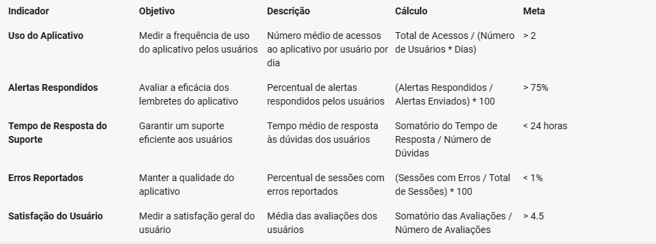
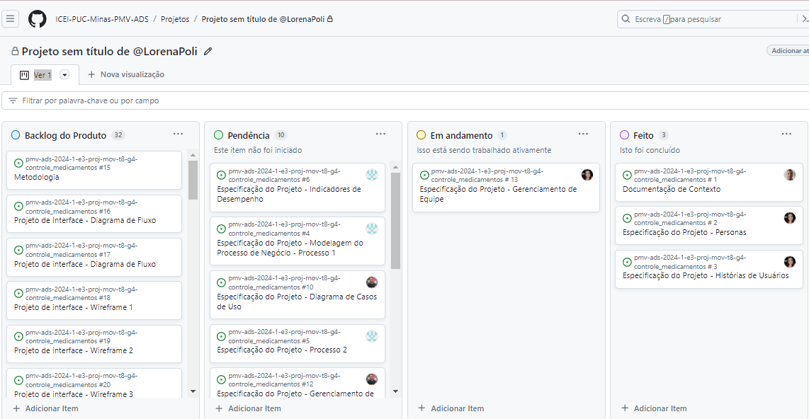

# Especificações do Projeto

Pré-requisitos: <a href="1-Documentação de Contexto.md"> Documentação de Contexto</a>

O problema da desorganização de horários no consumo de medicamentos e do estoque dos mesmos pode ser resolvido com o uso desta aplicação, uma vez que através de uma simples função pode-se obter a informação do horário exato de cosumação do remédio e a contagem das doses ainda restantes, facilitando a monitorização para a compra de novos medicamentos

No decorrer do processo de entendimento do projeto, foram observadas pessoas com diferentes rotinas, conforme apresentadas a seguir:

## Personas

**<h3 align="center" >Joaquim Araújo</h3 >**

 **Biografia**: 
Joaquim é auxiliar de almoxerifado e tem 29 anos, morando com os pais.
 

**Metas**: 
Tomar os medicamento na hora recomendada.

 
**Motivação**:
Busca melorar sua qualidade de vida.

**Frustação**:
Dificuldade em lembrar durante o expediente, de tomar o remédio dentro do horário.

**<h3 align="center" >Marina Garcia Januário</h3 >**

 **Biografia**: 
Marina é mãe de três filhos e tem 29 anos, mãe solteira vivendo sozinha com os filhos.
 

**Metas**: 
 Organizar-se melhor e não correr o risco de ficar sem medicamentos.

 
**Motivação**:
Preza pelo bem estar de seus filhos.

**Frustação**:
Se perder na quantidade de medicamentos que ainda restam, resultando em falta de remédio para seu filho.

**<h3 align="center" >Tereza Abrantes</h3 >**

 **Biografia**: 
Tereza  é cuidadora de idosos e tem 38 anos, mora nas casas dos idosos que cuida e na sua folga fica na casa dos pais.
 

**Metas**: 
Em dias de folga não ter que ir até à casa dos idosos ou ligar para eles, a fim de orientálos à tomar os remédios.

 
**Motivação**:
Usufruir do dia de folga sem ter a preocupação de fazer contato com o emprego.

**Frustação**:
Deixar de realizar alguma atividade em dias de folga, para administrar os remédios dos idosos que cuida.

## Histórias de Usuários

Com base na análise das personas forma identificadas as seguintes histórias de usuários:

|EU COMO... `PERSONA`| QUERO/PRECISO ... `FUNCIONALIDADE` |PARA ... `MOTIVO/VALOR`                 |
|--------------------|------------------------------------|----------------------------------------|
|Joaquim Araújo  | Administrar remédios na horá correta           | Não esquecer de fazê-los               |
|Marina Garcia Januário       | Organizar e controlar o estoque de medicamentos                 | Não faltar medicamentos |
|Tereza Abrantes  | Programar o lembrete de hora de consumo de medicamentos           | Não perder oportunidades em dias de folga|

## Modelagem do Processo de Negócio 

### Análise da Situação Atual

A falta de organização no estoque de medicamentos de pessoas que fazem uso contínuo de remédios e o esquecimento do consumo destes nos horários prescritos, podem ser resolvidos hoje com o uso de tabelas de controle de estoque e despertadores para auxiliar nessas dificuldades, mas com este projeto, podemos resolver esse problema em uma única aplicação. 

### Descrição Geral da Proposta

Este projeto visa proporcionar à qualquer pessoa, ter em suas mãos uma única aplicação, que possua essas duas funções: notificações para lembrar de tomar os remédios na hora exata e o aviso de quanto ainda resta de estoque, para evitar a falta dos mesmos.

### Processo 1 – NOME DO PROCESSO

Apresente aqui o nome e as oportunidades de melhorias para o processo 1. Em seguida, apresente o modelo do processo 1, descrito no padrão BPMN. 

### Processo 2 – NOME DO PROCESSO

Apresente aqui o nome e as oportunidades de melhorias para o processo 2. Em seguida, apresente o modelo do processo 2, descrito no padrão BPMN.

## Indicadores de Desempenho

### Requisitos Funcionais

|ID    | Descrição do Requisito  | Prioridade |
|------|-----------------------------------------|----|
|RF-001| O aplicativo deve conter campo para cadastro de usuário | ALTA | 
|RF-002| O aplicativo deve conter campo para cadastro de medicamentos | MÉDIA |
|RF-003| O aplicativo deve conter campo para quantificar os medicamentos cadastrados | MÉDIA |
|RF-004| O aplicativo deve conter campo para lançamento de horários de injestão dos remédios | MÉDIA |
|RF-005| O aplicativo deve conter uma tabela com demosntrativos da quantidade dos medicamentos que ainda restam | MÉDIA |
|RF-006| O aplicativo deve conter alarme para lembrar o usuário de tomar o remédio | MÉDIA |

### Requisitos não Funcionais

|ID     | Descrição do Requisito  |Prioridade |
|-------|-------------------------|----|
|RNF-001| O aplicativo deve ter fácil navegação e utilização | MÉDIA | 
|RNF-002| O aplicativo não exige treinamento prévio dos usuários |  BAIXA | 
|RNF-003| O aplicativo não prescreve medicamentos |  BAIXA | 
|RNF-004| O aplicativo não gera relatórios de horários em que foram consumidos medicamentos|  BAIXA | 

## Restrições

O projeto está restrito pelos itens apresentados na tabela a seguir.

|ID| Restrição                                             |
|--|-------------------------------------------------------|
|01| O projeto deverá ser entregue até o final do semestre |
|02| Não pode ser desenvolvido um módulo de backend        |

Enumere as restrições à sua solução. Lembre-se de que as restrições geralmente limitam a solução candidata.

> **Links Úteis**:
> - [O que são Requisitos Funcionais e Requisitos Não Funcionais?](https://codificar.com.br/requisitos-funcionais-nao-funcionais/)
> - [O que são requisitos funcionais e requisitos não funcionais?](https://analisederequisitos.com.br/requisitos-funcionais-e-requisitos-nao-funcionais-o-que-sao/)

## Diagrama de Casos de Uso

O diagrama de casos de uso é o próximo passo após a elicitação de requisitos, que utiliza um modelo gráfico e uma tabela com as descrições sucintas dos casos de uso e dos atores. Ele contempla a fronteira do sistema e o detalhamento dos requisitos funcionais com a indicação dos atores, casos de uso e seus relacionamentos. 

As referências abaixo irão auxiliá-lo na geração do artefato “Diagrama de Casos de Uso”.

> **Links Úteis**:
> - [Criando Casos de Uso](https://www.ibm.com/docs/pt-br/elm/6.0?topic=requirements-creating-use-cases)
> - [Como Criar Diagrama de Caso de Uso: Tutorial Passo a Passo](https://gitmind.com/pt/fazer-diagrama-de-caso-uso.html/)
> - [Lucidchart](https://www.lucidchart.com/)
> - [Astah](https://astah.net/)
> - [Diagrams](https://app.diagrams.net/)

# Matriz de Rastreabilidade

A matriz de rastreabilidade é uma ferramenta usada para facilitar a visualização dos relacionamento entre requisitos e outros artefatos ou objetos, permitindo a rastreabilidade entre os requisitos e os objetivos de negócio. 

A matriz deve contemplar todos os elementos relevantes que fazem parte do sistema, conforme a figura meramente ilustrativa apresentada a seguir.

> **Links Úteis**:
> - [Artigo Engenharia de Software 13 - Rastreabilidade](https://www.devmedia.com.br/artigo-engenharia-de-software-13-rastreabilidade/12822/)
> - [Verificação da rastreabilidade de requisitos usando a integração do IBM Rational RequisitePro e do IBM ClearQuest Test Manager](https://developer.ibm.com/br/tutorials/requirementstraceabilityverificationusingrrpandcctm/)
> - [IBM Engineering Lifecycle Optimization – Publishing](https://www.ibm.com/br-pt/products/engineering-lifecycle-optimization/publishing/)

# Gerenciamento de Projeto, Tempo e Equipe

Visando um processo de desenvolvimento mais adequado ao escopo do projeto, após análise do contexto, a equipe optou por utilizar o Scrum como estrutura ágil. A equipe está organizada da seguinte maneira: 

* Product Owner: Mário José Copertino Filho 

* Scrum Master: Lorena Poliane de Oliveira 

* Equipe de Desenvolvimento 

	* Lorena Poliane De Oliveira

	* Mário José Copertino Filho 

	* Matheus Marques Aguiar 

	* Thiago Singulano Machado  

* Equipe de Design 

		* Matheus Marques Aguiar 

	* Thiago Singulano Machado  

A plataforma Github Project está sendo utilizada pela equipe para organização e distribuição das tarefas do projeto, sendo as atividades segmentadas pelas listas a seguir: 
 
* **Product Backlog**: contém a lista de todas as macros tarefas previstas para a entrega de todo o projeto e, a cada sprint, serão elencadas para a lista “To do” conforme prioridades. Se necessário, podem ser descontinuadas. 

* **To Do**: a lista apresenta todas as tarefas elencadas para serem trabalhadas durante a sprint. 

* **In Progress**: apresenta as tarefas que já foram iniciadas pelos responsáveis atribuídos. 

* **Done**: assim que a tarefa é finalizada ela é apresentada nesta lista. Significa que não haverá mais a necessidade de atuação. 

O quadro kanban do GitHub Project utilizado pela equipe está disponível através da URL https://github.com/ICEI-PUC-Minas-PMV-ADS/pmv-ads-2024-1-e3-proj-mov-t8-g4-controle_medicamentos e atualmente, se encontra neste estado, conforme abaixo na Figura Kanban.  

## Gestão de Orçamento

O processo de determinar o orçamento do projeto é uma tarefa que depende, além dos produtos (saídas) dos processos anteriores do gerenciamento de custos, também de produtos oferecidos por outros processos de gerenciamento, como o escopo e o tempo.

