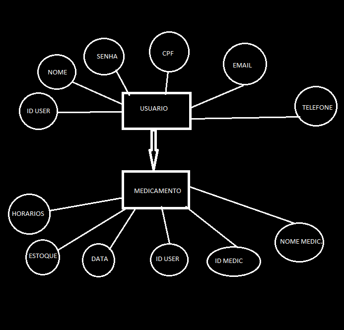

# Arquitetura da Solução

<span style="color:red">Pré-requisitos: <a href="3-Projeto de Interface.md"> Projeto de Interface</a></span>

Definição de como o software é estruturado em termos dos componentes que fazem parte da solução e do ambiente de hospedagem da aplicação.


## Diagrama de Classes

O diagrama de classes ilustra graficamente como será a estrutura do software, e como cada uma das classes da sua estrutura estarão interligadas. Essas classes servem de modelo para materializar os objetos que executarão na memória.


## Modelo ER

O Modelo ER representa através de um diagrama como as entidades (coisas, objetos) se relacionam entre si na aplicação interativa.]



## Esquema Relacional

O Esquema Relacional corresponde à representação dos dados em tabelas juntamente com as restrições de integridade e chave primária.
 

## Modelo Físico

Entregar um arquivo banco.sql contendo os scripts de criação das tabelas do banco de dados. Este arquivo deverá ser incluído dentro da pasta src\bd.

```-- Criação da tabela Paciente
CREATE TABLE Paciente (
  ID_Paciente INT PRIMARY KEY,
  Nome VARCHAR(255) NOT NULL,
  CPF VARCHAR(11) UNIQUE NOT NULL, 
  Data_Nascimento DATE,
  Genero VARCHAR(50),
  Endereco VARCHAR(255)
);

-- Criação da tabela Remedio
CREATE TABLE Remedio (
  ID_Remedio INT PRIMARY KEY,
  Nome VARCHAR(255) NOT NULL,
  Descricao TEXT,
  Dosagem VARCHAR(100),
  Periodo VARCHAR(50) 
);

-- Criação da tabela Horario_Remedio
CREATE TABLE Horario_Remedio (
  ID_Horario INT PRIMARY KEY,
  ID_Paciente INT,
  ID_Remedio INT,
  Data DATE NOT NULL,
  Hora TIME NOT NULL,
  Observacao TEXT,
  Notificacoes TEXT,
  FOREIGN KEY (ID_Paciente) REFERENCES Paciente(ID_Paciente),
  FOREIGN KEY (ID_Remedio) REFERENCES Remedio(ID_Remedio)
);
```

## Tecnologias Utilizadas

IDEs de desenvolvimento: https://docs.expo.dev/, Visual Studio Code, node.JS, Visual Studio 2022 e React Native;

Linguagens utilizadas: HTML, CSS, JavaScript;

Ferramenta de design: Canva;

Ferramenta de versionamento: Github;

Ferramenta de Gestão de Projeto: Github Projects;

Segue a representação da interatividade do usuário com o app.


1 O usuário acessa a aplicação.

2 A interface do aplicativo é carregada e exibida no dispositivo (React Native): 

3 O usuário utiliza os recursos como login, cadastro e navegação entre paginas

4 Ao acessar conteudo personalizado como login e senha, cadastro de medicamentos e etc, a aplicação busca as informações no banco de dados.

5 Após essa verificação o usuário recebe a validação, mensagens de alerta ou de acesso negado.

## Hospedagem

Explique como a hospedagem e o lançamento da plataforma foi feita.

> **Links Úteis**:
>
> - [Website com GitHub Pages](https://pages.github.com/)
> - [Programação colaborativa com Repl.it](https://repl.it/)
> - [Getting Started with Heroku](https://devcenter.heroku.com/start)
> - [Publicando Seu Site No Heroku](http://pythonclub.com.br/publicando-seu-hello-world-no-heroku.html)

## Qualidade de Software

Com base na norma ISO/IEC 25010, selecionamos as seguintes subcaracterísticas e métricas para nortear o desenvolvimento do nosso aplicativo de controle de medicamentos:

## 1. Funcionalidade:

**Adequação funcional:** O aplicativo deve atender aos requisitos de controle de medicamentos, como registro de doses, horários, lembretes e histórico de uso.
 **Métrica:** Percentual de requisitos funcionais implementados e testados com sucesso.

**Correção funcional:** O aplicativo deve executar as funções corretamente, sem erros ou falhas.
**Métrica:** Número de defeitos funcionais encontrados e corrigidos durante os testes.

## 2. Confiabilidade:

**Maturidade:** O aplicativo deve ser estável e apresentar baixo número de falhas durante o uso.
**Métrica:** Tempo médio entre falhas (MTBF).

**Tolerância a falhas:** O aplicativo deve ser capaz de se recuperar de falhas sem perda de dados ou interrupção do serviço.
**Métrica:** Tempo médio para recuperação (MTTR).

## 3. Usabilidade:

**Inteligibilidade:** O aplicativo deve ser fácil de entender e usar, com interfaces intuitivas e instruções claras.
**Métrica:** Tempo médio para completar tarefas básicas, número de erros cometidos pelos usuários durante o uso.

**Apreensibilidade:** O aplicativo deve ser fácil de aprender, com recursos de ajuda e tutoriais acessíveis.
**Métrica:** Tempo médio para novos usuários aprenderem a usar o aplicativo, número de solicitações de suporte relacionadas à usabilidade.

## 4. Eficiência:

**Comportamento em relação ao tempo**: O aplicativo deve responder rapidamente às ações do usuário e executar as tarefas em tempo hábil.
**Métrica:** Tempo médio de resposta do aplicativo, tempo de carregamento de telas e funcionalidades.

**Utilização de recursos**: O aplicativo deve utilizar os recursos do dispositivo de forma eficiente, sem consumir bateria ou memória em excesso.
**Métrica:** Consumo de bateria e memória do aplicativo durante o uso.

## 5. Segurança:

**Confidencialidade:** As informações do usuário devem ser protegidas contra acesso não autorizado.
**Métrica:** Número de tentativas de acesso não autorizado, número de vulnerabilidades de segurança encontradas e corrigidas.

**Integridade:** Os dados do aplicativo devem ser protegidos contra modificações não autorizadas.
**Métrica:** Número de tentativas de modificação não autorizada de dados, número de incidentes de perda ou corrupção de dados.

> **Links Úteis**:
>
> - [ISO/IEC 25010:2011 - Systems and software engineering — Systems and software Quality Requirements and Evaluation (SQuaRE) — System and software quality models](https://www.iso.org/standard/35733.html/)
> - [Análise sobre a ISO 9126 – NBR 13596](https://www.tiespecialistas.com.br/analise-sobre-iso-9126-nbr-13596/)
> - [Qualidade de Software - Engenharia de Software 29](https://www.devmedia.com.br/qualidade-de-software-engenharia-de-software-29/18209/)
