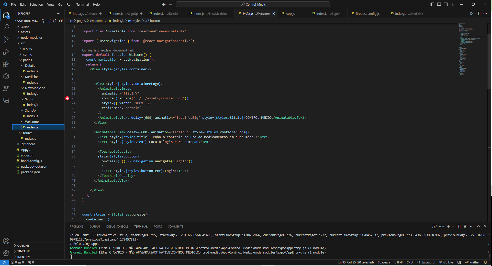

# Programação de Funcionalidades

Programação de Funcionalidades em Projeto Criado em React Native
A programação de funcionalidades em um projeto criado com React Native envolve várias etapas, desde a configuração inicial do ambiente até a implementação, teste e manutenção das funcionalidades desejadas. A seguir, será abordado um guia geral para desenvolver funcionalidades em um projeto React Native.

1. Configuração do Ambiente
Antes de iniciar o desenvolvimento, é necessário configurar o ambiente de desenvolvimento. Isso inclui:

Instalação do Node.js: React Native depende do Node.js, então a instalação da versão mais recente é essencial.
Instalação do Expo CLI ou React Native CLI: Para iniciar um novo projeto, pode-se usar o Expo CLI, que é mais fácil para iniciantes, ou o React Native CLI para mais flexibilidade.
Configuração de um Emulador ou Dispositivo Físico: Para testar o aplicativo, configure um emulador Android/iOS ou utilize um dispositivo físico.
2. Iniciando o Projeto
Para iniciar um novo projeto, usamos o comando:

| npx create-react-app Control_Medic |

3. Estrutura do Projeto
Uma vez criado, o projeto terá uma estrutura básica de pastas. Algumas pastas e arquivos importantes incluem:

App.js: O ponto de entrada do aplicativo.
/src: Pasta onde o código-fonte do aplicativo foi organizado (Welcome, SignIn, SignUp, Medicine, NewMedicine, Details).
/assets: Pasta para armazenar imagens
4. Implementação de Funcionalidades
A implementação de funcionalidades segue os princípios da programação baseada em componentes, onde cada funcionalidade pode ser encapsulada em um componente ou conjunto de componentes.

a. Criação de Componentes
Foram criados componentes como botões personalizados, listas e icones.

import React from 'react';
import { View, Text, StyleSheet, TextInput, TouchableOpacity } from 'react-native';

import * as Animatable from 'react-native-animatable'

import { useNavigation } from '@react-navigation/native';
export default function SignIn() {
  const navigation = useNavigation();
  return (
    <View style={styles.container}>
      <Animatable.View animation="fadeInLeft" delay={500} style={styles.containerHeader}>
        <Text style={styles.message}>Bem-vindo(a)</Text>
      </Animatable.View>

      <Animatable.View animation="fadeInUp" style={styles.containerForm}>
        <Text style={styles.title}>Email</Text>
        <TextInput
          placeholder="Digite um email..."
          keyboardType="email-address"
          autoCapitalize="none"
          autoComplete="email"
          style={styles.input}
        />

        <Text style={styles.title}>Senha</Text>
        <TextInput
          placeholder="Sua senha"
          autoCapitalize="none"
          secureTextEntry
          style={styles.input}
        />

        <TouchableOpacity style={styles.button}
        onPress={() => navigation.navigate('Medicine')}>
          <Text style={styles.buttonText}>Acessar</Text>
          
        </TouchableOpacity>

        <TouchableOpacity style={styles.buttonRegister}
          onPress={() => navigation.navigate('SignUp')}>

          <Text style={styles.registerText}>Não possui uma conta? Cadastre-se</Text>
        </TouchableOpacity>

      </Animatable.View>

    </View>
  );
}

const styles = StyleSheet.create({
  container: {
    flex: 1,
    backgroundColor: '#FF0000'
  },
  containerHeader: {
    marginTop: '14%',
    marginBottom: '8%',
    paddingStart: '5%',
  },

b. Navegação
Para navegação entre telas, utilize bibliotecas como react-navigation. Para configurar a navegação básica:

import { createNativeStackNavigator } from '@react-navigation/native-stack';
import { NavigationContainer } from '@react-navigation/native';

import Welcome from '../pages/Welcome'
import SignIn from '../pages/SignIn';
import SignUp from '../pages/SignUp';
import Medicine from '../pages/Medicine';
import NewMedicine from '../pages/NewMedicine';
import Details from '../pages/Details';

const Stack = createNativeStackNavigator();

export default function Routes() {
    return (
        <Stack.Navigator>
            <Stack.Screen
                name="Welcome"
                component={Welcome}
                options={{ headerShown: false }}
            />

            <Stack.Screen
                name="SignIn"
                component={SignIn}
                options={{ headerShown: false }}
            />

            <Stack.Screen
                name="SignUp"
                component={SignUp}
                options={{ headerShown: false }}
            />

            <Stack.Screen
                name="Medicine"
                component={Medicine}
                options={{ headerShown: false }}
            />
           
           <Stack.Screen
                name="NewMedicine"
                component={NewMedicine}
                options={{ headerShown: false }}
            />
            
            <Stack.Screen
                name="Details"
                component={Details}
                options={{ headerShown: false }}
            />
           
        </Stack.Navigator>
    )

}

c. Gerenciamento de Estado
Para gerenciar o estado global do aplicativo, utilize Context API ou bibliotecas como Redux. Para um exemplo com Context API:

jsx
Copiar código
// src/context/AppContext.js
import React, { createContext, useState } from 'react';

export const AppContext = createContext();

export const AppProvider = ({ children }) => {
  const [state, setState] = useState({ user: null });

Conclusão
A programação de funcionalidades em um projeto React Native envolve diversas etapas e o uso de várias ferramentas e bibliotecas. Desde a configuração do ambiente até a implementação de componentes, navegação, gerenciamento de estado e testes, cada passo é essencial para criar aplicativos móveis eficientes e escaláveis. Seguindo as melhores práticas, é possível desenvolver funcionalidades robustas e fornecer uma experiência de usuário de alta qualidade.

