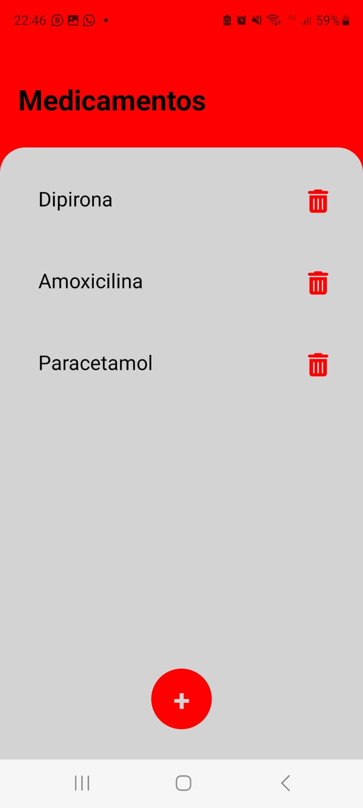

# Registro de Testes de Software

Relatório com as evidências dos testes de software realizados no sistema pela equipe, baseado em um plano de testes pré-definido.

## Avaliação

| ID | Nome do Teste | Status | Data do Teste | Responsável | Observações |
| --- | --- | --- | --- | --- | --- |
| RF-001 | Cadastro de usuário - Campos Obrigatórios Ausentes | falhou | 26/05/2024 | Mario Jose | em desenvolvimento |
| RF-001 | Login com Nome de Usuário ou senha incorreta | falhou  | 23/06/2024  | Mario Jose | em desenvolvimento |
| RNF-001 | Navegação entre páginas incompletas | em progresso  | 26/05/2024  | Matheus Marques | Alguns atalhos não funcionam |

## RF-001

## RF-001

## RNF-001

